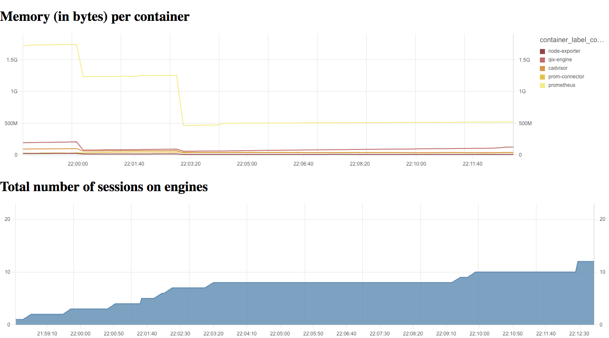

# core-grpc-prometheus-connector

## Get started

Note, Qlik Associative Engine needs to be started with something similar to this: `-S EnableGrpcCustomConnectors=1 -S GrpcConnectorPlugins="prometheus-connector,prom-connector:9001" -S EnableConnectivityService=0`.

Requires an existing prometheus server running, and change the hard-coded value in
`src/connector.py`.

### Run locally

Requires python3.

```bash
pip install -r requirements.txt
```

```bash
python src/.
```

#### Regenerating code

Update `./connector.proto` to a new version, then:

```bash
python gen_code.py
```

### Build Docker image

```bash
docker build . -t prom-connector
```

## Running the example

The example is pretty rough right now and likely not in a working state, use
at your own risk!

Requires Node.js version 9+.

```bash
cd example
ACCEPT_EULA=yes docker-compose up -d --build --force-recreate
cd ui
npm i
npx webpack --mode development
open dist/index.html
```


